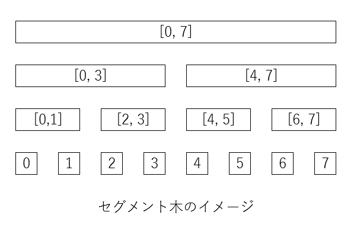

# はじめに
競プロ勉強会第3回です。今回は列に関するデータ構造です。  

> 目次  
>
> (水色向け)  
>
> 1. 累積和  
> 2. imos法  
> 3. Segment Tree  
> 4. 平方分割
> 5. BIT  
> 6. 動的Segment Tree  
> 7. 遅延伝播Segment Tree  
> 8. Segment Tree beats  
> 9. Sparse Table  
>
> (青色向け)  
>
> 10. 永続Segment Tree  
> 11. 領域木 Fractional-Cascading  
> 12. Segment Tree上の二分探索  
> 13. 平衡二分探索木treap  
> 14. 平衡二分探索木treap  

# 1. 累積和
(問題)数列$a_i$が与えられる。クエリl, rに対し、$a_l + a_{l+1} + ... + a_r$を求めよ  

有名問題ですね。$b_i = a_1 + a_2 + ... + a_i$と置き、最初に計算しておくと求めるものは$b_r-b\_{l-1}$になりますね。

```
int a[100000], b[100001];
void build() {
  b[0] = 0;
  for (int i = 0; i < n; i++) b[i+1] = b[i] + a[i];
  // 簡単のためb_iを[0, i)の和として1個ずらしている
}
void get(int l, int r) {
  return b[r+1] - b[l];
}
```

せっかくなのでclassで抽象化してしまいましょう。  

```
class CumulativeSum {
  vector<int> a, b;
  bool flag;
  void build() {
    for (int i = 0; i < (int)a.size(); i++) b[i+1] = b[i] + a[i];
    flag = false;
  }
public:
  CumulativeSum(int n) : a(n, 0), b(n+1, 0) { flag = true; }
  CumulativeSum(vector<int> _a) : a(_a), b(_a.size() + 1, 0) { flag = true; }
  void change(int i, int x) {
    a[i] = x;
  }
  void add(int i, int x) {
    a[i] += x;
  }
  int get(int l, int r) { // [l, r)の範囲を求める
    if (flag) {
      build();
    }
    return b[r] - b[l];
    // 閉区間か半開区間かはお好きにどうぞ
  }
};
```

累積和くらい何も見ずに30秒程度で書けるようになるべきですが、普段はライブラリを使えばいいと思います。コード量と時間の短縮になりますし、ライブラリ部分はバグらないですし、頭のリソースを累積和の実装に使いたくないので。みんなライブラリ整備しようね。  

累積和に載せられる代数構造は何でしょうか？答えは群です。そもそも基本的な代数構造を知らない人のために簡単な説明をしておきます。  

| 代数構造   | 説明                       | 例             |
| ---------- | -------------------------- | -------------- |
| マグマ     | 集合とその集合上の二項演算 |                |
| 半群       | マグマ+結合則              | min, max, gcd  |
| モノイド   | 半群+単位元e(e\*a=a\*e=a)  | 行列           |
| 群         | モノイド+逆元              |                |
| アーベル群 | 群+可換則(a\*b=b\*a)       | 足し算, 掛け算 |

get()の中を見れば分かりますが、+に対して-(逆元)が必要ですね。もし[0, i)の情報以外いらないのであれば半群でいけます。前回学んだ繰り返し二乗法は半群に対して実行可能です。  

単一の値更新がO(1)、構築がO(n)、範囲取得がO(1)です。動的な更新は効率的に行えません。  

ところで皆さん半開区間は好きですか？僕は大好きです。理由は簡単で閉区間だと区間の分割や併合で頭がバグるからです。細かい違いに見えるかもしれないですが、かなり変わります。意識してみて下さい。  

# 2. imos法  
(問題)最初0がn個並んでいる。[l, r)の区間に+xをするクエリをq回行った後の数列を求めよ  

この数列の差分に着目してみましょう。l-1からlで+xされ、r-1からrで-xされますね。差分の変化はO(1)で計算できるので、差分の数列を持っておいてそれを元に構築すればよいですね。  

```
class CumulativeSum {
  vector<int> a, diff;
  bool flag;
  void build() {
    for (int i = 0; i < (int)a.size(); i++) a[i+1] = a[i] + diff[i];
    flag = false;
  }
public:
  CumulativeSum(int n) : a(n+1, 0), diff(n, 0) { flag = true; }
  void add(int l, int r, int x) { // [l, r) +x
    diff[l] = x;
    diff[r] = -x;
  }
  int get(int i) {
    if (flag) {
      build();
    }
    return a[i+1];
  }
};
```

範囲の値更新がO(1)、構築がO(n)、単一の値取得がO(1)です。動的な更新は効率的に行えません。  

数列の差分を見るという考え方は非常に重要で、高難易度の問題でも使われます。  

# 3. Segment Tree  
今日のメインディッシュです。モノイドに対して値の変更、区間演算をO(log n)で行うスグレモノです。イメージとしては下の画像のように完全二分木を作ると、任意の区間は高々O(log n)個の区間の和で表せるんですね。びっくりです。例えば[1, 7]は[1, 1], [2, 3], [4, 7]です。小さい例だと本当にlon nに落ちるか分かりにくいですね。  



適当に証明すると、完全二分木なので高さはlog nです。各行に対して選ばれるのは高々4個です。何故なら5個以上選ばれるなら3連続で選ばれる部分が存在し、その中の2連続のものうちどちらかは親が共通で、親を選ぶ方がよいからです。ガバガバですね。  

完全二分木の場合、根から順番に1, 2, 3, 4, 5,...と番号をつけると各ノードiの親はi/2, 子供は2\*i, 2\*i+1です。indexが1から始まる事に注意して下さい。  

```
template <typename T>
class SegmentTree {
  int n;
  vector<T> node;
  function<T(T, T)> fun, fun2;
  bool customChange;
  T outValue, initValue;
public:
  SegmentTree(int num, function<T(T, T)> resultFunction, T init, T e, function<T(T, T)> changeFunction = NULL) {
    // changeFunction: (input, beforevalue) => newvalue
    fun = resultFunction;
    fun2 = changeFunction;
    customChange = changeFunction != NULL;
    n = 1;
    while (n < num) n *= 2;
    node.resize(2 * n);
    fill(node.begin(), node.end(), init);
    outValue = e;
    initValue = init;
  }
  void change(int num, T value) {
    num += n-1;
    if (customChange) node[num] = fun2(value, node[num]);
    else node[num] = value;
    while (num > 0) num /= 2, node[num] = fun(node[num * 2], node[num * 2 + 1]);
  }
  T get(int a, int b, int l = 0, int r = -1, int k = 1) { // [a, b)
    if (r == -1) r = n;
    if (a <= l && r <= b) return node[k]; // 完全に範囲内
    if (b <= l || r <= a) return outValue; //
    int mid = (l + r) / 2;
    return fun(rangeQuery(a, b, l, mid, 2*k), rangeQuery(a, b, mid, r, 2*k+1));
  }
};
// 個数, 演算, 初期値, 単位元(, 変更関数)を指定します
// int sum(int a, int b) { return a + b; }
// SegmentTree<int> sgt(n, sum, 0, 0);
// sgt.change(i, x); // i番目をxに変更
// sgt.get(a, b); // [a, b)の範囲の演算結果を返す
// もし、値の変更ではなく、元の値に追加したい時は
// SegmentTree<int> sgt(n, sum, 0, 0, sum);
// とすればよい(この仕様あまり好きじゃないけど)
```

最悪使い方さえ分かればいいです。かなり便利で、高難易度問題の一部によく使われます。簡単な問題もこれで殴れたりする。  

基本はモノイドに対して行えますが、単位元を無理やり作る事で半群も載せる事が出来ます。例えばminの単位元はINF, maxは-INF, gcdは0です。ちょっと頑張れば単位元が不要なSegment Treeも作れますが、[i, i)のクエリが飛んで来た時返す値に困るのでやめました。モノイドclassを分離するのがいいかも。  

単一の値更新がO(log n)、範囲取得がO(log n)です。動的に更新できます。  

# 4. 平方分割  
セグメントツリーで不可能なクエリも要素を√n個に分割する事で色んなクエリがO(√n)で実行できます。セグメントツリーに比べて遅いですが、汎用的です。問題を見る方がいいでしょう。  

# 5. BIT  
ほぼセグメントツリーと同じだがモノイドでは無くアーベル群に制限したもの。つまり、最小値を求めるクエリとかには対応できない。というか(int, +, 0)でしか見た事が無い。その分実装と定数倍が速い。  

コードは間に合いませんでした。  

# 6. 動的Segment Tree  
普通のSegment Treeは[0, n)の範囲なのでnが非常に大きい時はそのまま使えない。しかしオフラインクエリ(クエリが全部分かっている)の時は座標圧縮すると解けますが、オンラインクエリ(次のクエリが何か分からない)の時は使えません。だいたい座標圧縮でいけますが、オンラインクエリの時も動的Segment Treeを使えばよいです。  

やりたい事は簡単で、必要になるまで要素を作らない、値変更クエリが飛んできて初めて要素を作る感じです。  

# 7. 遅延伝播Segment Tree  
SegmentTreeは単一更新範囲取得が可能ですが、遅延伝播Segment Treeを使うと範囲更新が可能です。強いですね。その分実装と定数倍が重いです。これで殴れるって気づいたらライブラリを探しに行って下さい。いずれ書きます。  

# 8. Segment Tree beats  
遅延伝播STは範囲更新の時、chminを行う事はできません。chminは元の値と与えられた値の小さい方に変更するクエリです。それをO($(log n)^2$)で行う事ができます。僕もまだ理解出来てません。できたら書きます。  

# 9. Sparse Table  
セグメントツリーの静的なやつで主にmin, maxに対して構築O(n log n)クエリO(1)にしたバージョンです。各点から$1, 2, 2^2, ...$の距離までの結果を持っておくと[a, b)のクエリは[a, a+2^t), [b-2^t, b)の解の

# 11. SWAG  
# 12. 永続Segment Tree  
# 13. 領域木 Fractional-Cascading  
# 14. Segment Tree上の二分探索  
# 15. 平衡二分探索木treap  
# 16. 平衡二分探索木treap  
